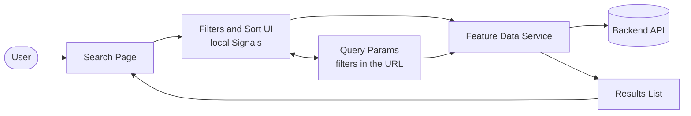
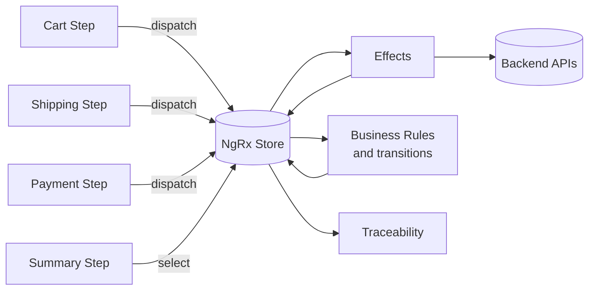

# You probably don't need NgRx

### But you probably do need clearer state boundaries.

  Thomas Toledo

  Senior Frontend Developer / Angular / React / TypeScript

---
layout: center
class: bg-slate-950
transition: slide-up | slide-down
---

# In this talk

  

    
01

    
Why teams default to NgRx

  

  

    
02

    
The different kinds of state

  

  

    
03

    
Smaller defaults in Angular

  

  

    
04

    
When NgRx earns its cost

  

  
05

  
Two concrete examples

---
layout: two-cols
layoutClass: gap-12
class: bg-slate-950
---

# Who am I?

- Thomas Toledo
- Senior Frontend Developer
- Angular / React / TypeScript
- I build and maintain complex frontend applications
- I care about architecture, clarity, and pragmatic state management
- I write and teach about Angular

::right::

  
Find me

  
thomastoledo.github.io

  
linkedin.com/in/thomastoledo

---
layout: two-cols
layoutClass: gap-10
class: bg-slate-950 text-white
---

# NgRx summary

  The Store pattern gives us explicit actions, reducers, selectors, and effects.

  It solves real coordination problems, but it also introduces real architectural weight.

  Reference

  https://ngrx.io/guide/store

::right::

  

    
  

---
class: bg-slate-950
transition: slide-left | slide-right
---

# Why teams default to NgRx

  

    
It feels like the safe default

    
It is familiar, documented, and widely adopted across Angular teams.

  

  

    
We want to look scalable

    
A store can make the app feel more serious even before the app really needs it.

  

  

    
We want one mental model

    
One tool for every state problem sounds cleaner than deciding case by case where state should live.

  

  

    
We are solving future problems early

    
Teams often install NgRx to prepare for complexity that has not arrived yet.

  

  
The reflex

  

    The habit is often stronger than the actual problem.
  

---
class: bg-slate-950
transition: slide-left | slide-right
---

# Example 1: Search, filters, and pagination

  Context: search input, filters, sorting, pagination, API results, and maybe filters saved in the URL.

  

    
Why teams often over-engineer this

    <ul class="mt-4 space-y-2">
      <li>There seem to be many moving parts.</li>
      <li>Several user interactions affect the same screen.</li>
      <li>It feels safer to centralize everything.</li>
      <li>It looks like "a lot of state".</li>
    </ul>
  

  

    
Why I still would not start with NgRx

    <ul class="mt-4 space-y-2">
      <li>Most of it is UI state plus server state.</li>
      <li>Filters can live in query params.</li>
      <li>Results belong to a data service, not automatically an app-wide store.</li>
      <li>All of this still belongs to one screen or feature.</li>
    </ul>
  

  
Use instead

  

    Component Signals for local UI, query params for URL-backed filters, and a feature data service for fetching results.
  

---
layout: center
class: bg-slate-950
transition: slide-up | slide-down
---

# Schema: keep the state small

  Keep each kind of state in the place that already fits: local UI in the component, URL filters in the route, and backend data in a feature service.

---
class: bg-slate-950
transition: slide-up | slide-down
---

# Different kinds of state

  

    
UI state

    
Open or closed modals, active tabs, loading flags, selected rows, short-lived interactions.

  

  

    
Form state

    
Inputs, validation, dirty status, step progress, and temporary draft values.

  

  

    
Server state

    
Backend data, caching, refetching, loading, error handling, synchronization.

  

  

    
Client or domain state

    
Cart contents, saved filters, step-by-step progress, business rules, state shared across screens.

  

  Not every kind of state needs the same tool, or even the same place to live.

---
class: bg-slate-950
transition: slide-left | slide-right
---

# Smaller defaults first

  

    
UI state

    
Component state and Signals

    
Keep short-lived state close to the component that owns the interaction.

  

  

    
Form state

    
Angular forms

    
Forms already model validation, dirtiness, submission, and step-by-step progress well.

  

  

    
Server state

    
Route state plus a data service

    
Use query params for URL state and keep fetching or caching close to the feature.

  

  

    
Shared feature state

    
Feature service or SignalStore

    
Keep shared state inside the feature before turning it into an app-wide event system.

  

---
class: bg-slate-950
---

# Hidden cost of NgRx

  

    <strong>More things to learn</strong> - Actions, reducers, selectors, effects, and extra patterns the team needs to understand.
  

  

    <strong>Scattered logic</strong> - One user interaction can be split across multiple files and abstractions.
  

  

    <strong>Onboarding cost</strong> - Developers may need to learn the state architecture before they can change product behavior safely.
  

  

    <strong>Everything drifts into the store</strong> - Once the store exists, teams are tempted to put more and more state into it.
  

  You are paying for extra machinery, whether or not the app truly needs it yet.

---
class: bg-slate-950
---

# When NgRx is worth it

  
State is shared across far-apart parts of the app

  
The allowed steps in the flow must stay clear and consistent

  
Traceability matters: you need to explain why something happened

  
One action triggers several follow-up actions

  
Many developers need the same rules and patterns

  
You are modeling a process, not just a screen

---
class: bg-slate-950
transition: slide-up | slide-down
---

# A few loaded words

  

    
Business transitions

    

      The allowed step changes in a flow.
    

    

      Example: an order can go from <strong>cart</strong> to <strong>paid</strong> to <strong>shipped</strong>, but not directly from <strong>cart</strong> to <strong>shipped</strong>.
    

  

  

    
Chaining several actions

    

      One event triggers several external actions.
    

    

      Example: after payment succeeds, save the order, reserve stock, clear the cart, and send a confirmation email.
    

  

  

    
Traceability

    

      Being able to answer "what happened and why?"
    

    

      Example: why did this order end up canceled, or why did this user lose their discount?
    

  

  

    
Auditing or replay

    

      Looking back at the sequence later, or replaying it.
    

    

      Example: support or compliance can review the steps that led to a refund, duplicate charge, or failed checkout.
    

  

---
layout: center
class: bg-slate-950
transition: slide-up | slide-down
---

# When the flow gets big enough for NgRx

  This is where NgRx starts paying for itself: several parts of the app need to stay in sync through shared events, rules, and follow-up actions.

---
class: bg-slate-950
transition: slide-left | slide-right
---

# Example 2: Multi-step checkout

  Context: cart, shipping, delivery, payment, summary, back-and-forth navigation, partial save, and business rules that may grow over time.

  

    
Start here

    <ul class="mt-4 space-y-2">
      <li>Angular forms for each step</li>
      <li>A feature service or SignalStore for the checkout session</li>
      <li>Keep state inside the checkout feature</li>
      <li>Persist a draft only if the product really needs it</li>
    </ul>
  

  

    
Move to NgRx when

    <ul class="mt-4 space-y-2">
      <li>Rules and allowed state changes multiply</li>
      <li>One action triggers many external effects</li>
      <li>Several separate parts of the app take part in the flow</li>
      <li>You need to explain and recover what happened</li>
    </ul>
  

  
Recommendation

  

    Start inside the checkout feature. Move to NgRx if checkout turns into a core business flow with lots of rules.
  

---
class: bg-slate-950
transition: slide-up | slide-down
---

# Quick decision framework

  

    
Keep it local

    <ul class="mt-4 space-y-2">
      <li>One screen or one interaction</li>
      <li>Mostly UI or form state</li>
      <li>Short-lived and easy to explain</li>
      <li>Component state is enough</li>
    </ul>
  

  

    
Keep it in the feature

    <ul class="mt-4 space-y-2">
      <li>A few screens share the state</li>
      <li>There is a flow with a clear start and end</li>
      <li>It only matters inside one feature</li>
      <li>Use a feature service or SignalStore</li>
    </ul>
  

  

    
Reach for NgRx

    <ul class="mt-4 space-y-2">
      <li>Distant shared state</li>
      <li>Important business steps</li>
      <li>Hard-to-follow logic across screens and API calls</li>
      <li>You need to explain what happened</li>
    </ul>
  

  The question is not "do we have state?" It is "where should it live?"

---
class: bg-slate-950
transition: slide-left | slide-right
---

# If not NgRx, then what?

  

    
Angular Signals + services

    

      Usually the best default for local state and feature state.
    

  

  

    
NgRx SignalStore

    

      A more structured option when a feature needs more shape, but not the full Store pattern.
    

  

  

    
NGXS

    

      Another Angular-focused store option with a simpler mental model for some teams.
    

  

  

    
Elf

    

      Lightweight and modular if you want a store approach with less framework weight.
    

  

  

    The best alternative is often not a different state library.
  

  

    It is a smaller state boundary and a simpler default.
  

---
layout: center
background: /pptx-assets/image1.jpeg
class: text-white
transition: slide-up | slide-down
---

  "I freaking love NgRx"

  Thomas Toledo

---
layout: cover
background: /pptx-assets/image1.jpeg
class: text-white
transition: slide-left | slide-right
---

# NgRx is not the default. It is a trade-off.

  <ul class="space-y-4 text-2xl leading-9">
    <li>Keep local state local</li>
    <li>Keep feature state inside the feature</li>
    <li>Don't confuse server state with app state</li>
    <li>Reach for NgRx when the complexity is real</li>
  </ul>

  
You probably don't need NgRx.

  
You do need clear state boundaries.

---
layout: center
background: /pptx-assets/image1.jpeg
class: text-white
transition: slide-up | slide-down
---

  Thank you

  Questions?

